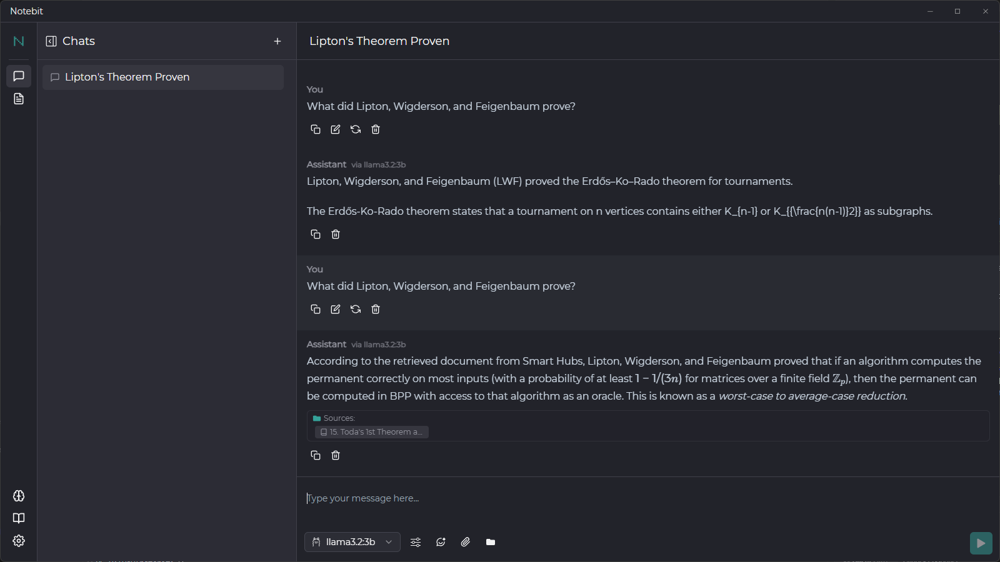
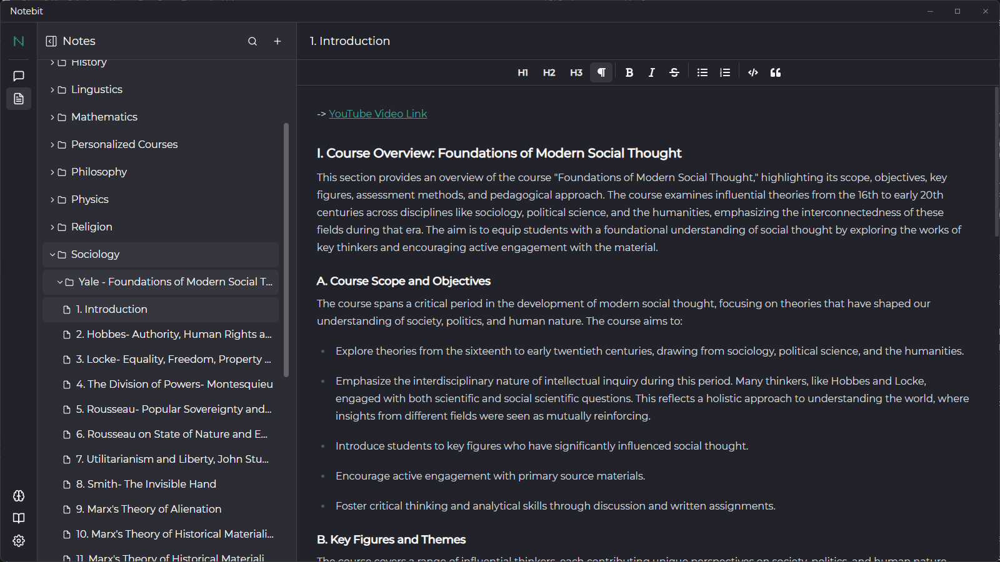
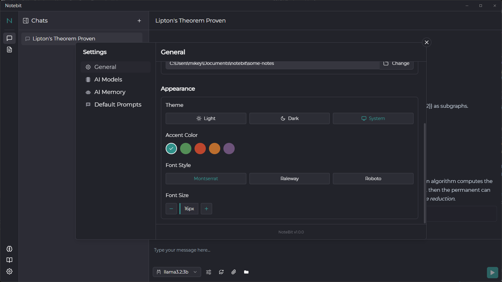
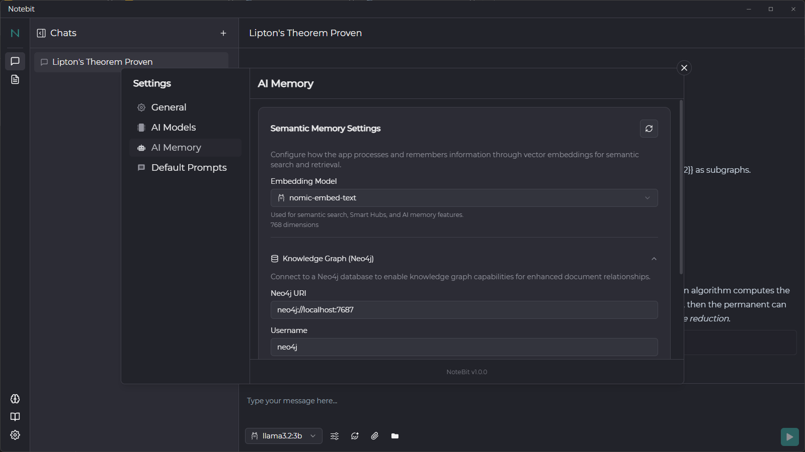
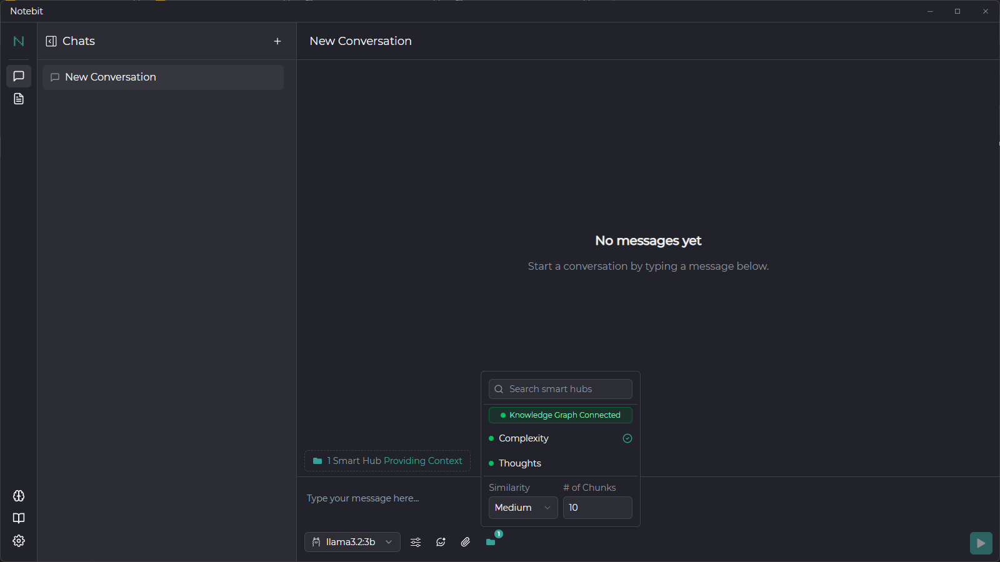

<div align="center">
  
  <h1>Notebit</h1>
  <h3>Your Intelligent Note-Taking & AI-Powered Knowledge Companion</h3>
  <p>
    Cross-platform desktop application (Windows, macOS, Linux) designed to seamlessly integrate powerful AI chat
    with your personal notes and knowledge bases. Built with Electron, React, TypeScript, and an offline-first architecture.
  </p>
  <p>
    
    
    
    <!-- Add more badges as appropriate: build status, downloads, etc. -->
  </p>
</div>

## Overview

Notebit redefines the note-taking experience by placing AI at its core. It's not just about storing notes; it's about actively engaging with your knowledge through intelligent chat, powerful organization tools, and personalized AI assistance. Whether you're researching complex topics, drafting content, or simply organizing your thoughts, Notebit provides a smart, secure, and always-accessible environment. With its offline-first architecture powered by local PouchDB storage, your data remains private and available anytime, anywhere.

## ✨ Core Features

Notebit is packed with features designed to enhance your productivity and unlock new ways of interacting with your information:

#### 🧠 **Intelligent AI Chat & Assistance**

- **Omnipresent AI Chat:** Engage in dynamic conversations with AI directly within a dedicated chat interface or through contextually aware assistance across the app.
- **Flexible AI Model Support:** Connect to a vast array of AI providers:
  - Local LLMs via **Ollama** (e.g., Llama3, Mistral, Gemma).
  - Cloud-based services: **OpenAI (GPT models), Google (Gemini), Anthropic (Claude), Groq, Perplexity, LMStudio, SiliconFlow, xAI**, and more.
- **Customizable Model Parameters:** Fine-tune AI behavior (temperature, max tokens, context limit, Top P) and save custom model configurations.
- **Dynamic Model Switching:** Easily switch between AI models and providers on-the-fly within any chat.
- **In-Chat Document Analysis:** Upload documents (PDF, TXT, etc.) directly into chats for immediate AI summarization, Q&A, or analysis.

#### 📝 **Advanced Note-Taking & Organization**

- **Rich Text Editor:** Craft beautiful and detailed notes with a powerful [Tiptap](https://tiptap.dev/)-based editor, supporting:
  - Headings, bold, italics, strikethrough, highlights.
  - Bulleted & numbered lists, blockquotes, code blocks (with syntax highlighting).
  - Link embedding.
  - Markdown.
  - & LaTeX.
- **Hierarchical Folder System:** Intuitively organize your notes with a nested folder structure for granular classification.

#### 📚 **Smart Hubs: Your Personalized Knowledge Bases**

- **Centralized Content Aggregation:** Create "Smart Hubs" to group related documents from various local sources.
- **Multi-Format Support:** Add individual files (`.pdf`, `.md`, `.csv`, `.txt`, `.docx`, `.epub`, `.json`, `.jsonl`, `.rtf`) or link entire folders.
- **Contextual AI Chat:** Select Smart Hubs to provide deep, relevant context to your AI conversations. Control retrieval parameters like similarity and chunk count.
- **Content Processing & Indexing:** Notebit processes and indexes content within Smart Hubs, enabling semantic search and AI understanding.

#### 🚀 **Prompt Engineering & Management**

- **Prompt Library:** Build, manage, and tag a personal library of reusable system and user prompts.
- **In-Chat Prompt Injection:** Seamlessly apply prompts from your library within ongoing chats to guide AI responses.
- **Default Prompts Configuration:** Define default system prompts for new chats, title generation, and other AI interactions.

#### 🔍 **AI Memory & Semantic Search**

- **Configurable Embedding Models:** Choose from various embedding models (e.g., `nomic-embed-text`, Ollama-served models) to power semantic understanding.
- **Deep Search:** Find information based on meaning and context, not just keywords, across your notes and Smart Hubs.

#### 🎨 **Comprehensive Customization & Settings**

- **Appearance:** Light, Dark, & System themes; customizable accent colors, font styles, and font sizes.
- **AI Model Management:** Enable/disable providers, configure connection settings (e.g., Ollama API host), refresh model lists, and add custom models.
- **Data Management:** Define notes storage location and manage AI Memory (embedding model) settings.
- **General Settings:** Control link behavior, automatic chat title generation, and more.

#### 🌐 **Cross-Platform & Offline-First**

- **Works Everywhere:** Use Notebit consistently on Windows, macOS, and Linux.
- **Always Accessible:** Full offline functionality for notes and core features, thanks to local PouchDB storage. Your data is yours.

## 📸 Screenshots

<details>
<summary>Click to expand screenshots</summary>

|                Chat Interface                 |          Notes & Rich Text Editor           |
| :-------------------------------------------: | :-----------------------------------------: |
|  |  |

|        Smart Hubs / Knowledge Base        |                  Prompt Library                   |
| :---------------------------------------: | :-----------------------------------------------: |
|  |  |

|                  Settings: General & Appearance                  |             Settings: AI Model Configuration              |
| :--------------------------------------------------------------: | :-------------------------------------------------------: |
|  |  |

|                    Settings: AI Memory                    |                In-Chat Features (Prompts, Hubs, Docs)                |
| :-------------------------------------------------------: | :------------------------------------------------------------------: |
|  |  |

</details>

## 🛠️ Tech Stack

### Core

- **Electron**: Cross-platform desktop application framework
- **React**: UI library for building the interface
- **TypeScript**: Type-safe JavaScript
- **Vite (via `electron-vite`)**: Fast build tooling and development server

### Data Management & State

- **PouchDB**: Offline-first local database for notes and application data
- **Legend State**: Performant state management library
- **TanStack React Router**: Type-safe routing for the web/renderer process
- **tRPC**: End-to-end typesafe APIs for communication between main and renderer processes

### User Interface

- **Tailwind CSS**: Utility-first CSS framework for rapid UI development
- **shadcn/ui**: Re-usable and accessible UI components

### Artificial Intelligence

- **Vercel AI SDK**: Core SDK for interacting with various AI language models and providers
- Extensive support for multiple LLM providers and local models via Ollama.

## 🚀 Getting Started

### Prerequisites

- Node.js (v18+ recommended)
- npm or yarn

### Installation

1.  Clone the repository:
    ```bash
    git clone https://github.com/embium/notebit.git
    ```
2.  Navigate to the project directory:
    ```bash
    cd Notebit
    ```
3.  Install dependencies:
    ```bash
    npm install
    # or
    # yarn install
    ```

### Development

To start the application in development mode with hot-reloading:

```bash
npm run dev
```

````

### Building for Production

To build the application for packaging:

```bash
npm run build
```

This will compile the TypeScript code and prepare assets.

### Packaging for Distribution

To package the application for your current platform or specific platforms:

```bash
npm run package          # Package for current platform
npm run package:win    # Package for Windows
npm run package:mac    # Package for macOS
npm run package:linux  # Package for Linux
```

Packaged applications will be found in the `release/${version}` directory.

## 🏗️ Project Structure

A brief overview of the main directories:

- `src/main`: Electron main process code (Node.js environment). Handles window management, system interactions, and tRPC backend.
- `src/preload.ts`: Secure bridge script between the main and renderer processes, exposing necessary APIs via `contextBridge`.
- `src/shared`: Code, types, and utilities shared between the main and renderer processes (e.g., tRPC router definitions).
- `src/web`: Renderer process code (React application running in the browser-like environment).
  - `app/`: Core application setup, providers, global state.
  - `components/`: Reusable UI components (often built with shadcn/ui and Tailwind CSS).
  - `features/`: Self-contained modules for major application features (e.g., Notes, Chats, Settings, SmartHubs).
  - `routes/`: Routing configuration using TanStack React Router.
  - `shared/`: Web-specific shared utilities, hooks, and contexts.
- `src/assets/`: Static assets like icons and images.

## 🤝 Contributing

_(Optional: Add contribution guidelines if you plan to accept them)_
Contributions are welcome! Please feel free to submit a pull request or open an issue.

1. Fork the Project
2. Create your Feature Branch (`git checkout -b feature/AmazingFeature`)
3. Commit your Changes (`git commit -m 'Add some AmazingFeature'`)
4. Push to the Branch (`git push origin feature/AmazingFeature`)
5. Open a Pull Request

## 📜 License

This project is licensed under the MIT License - see the [LICENSE](LICENSE) file for details.

## ✍️ Author

Michael Mooney - [GitHub](https://github.com/embium)

---

## Share your passion: If you find Notebit useful, consider starring the repository! ⭐
````
